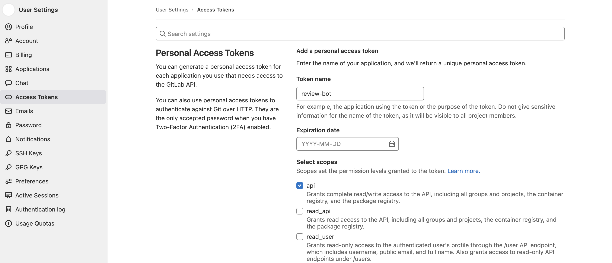
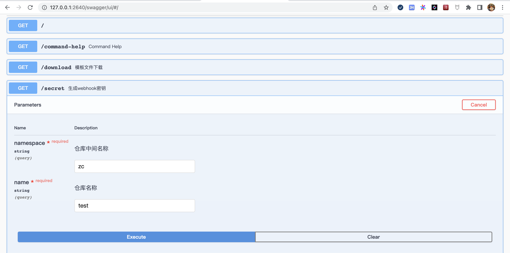
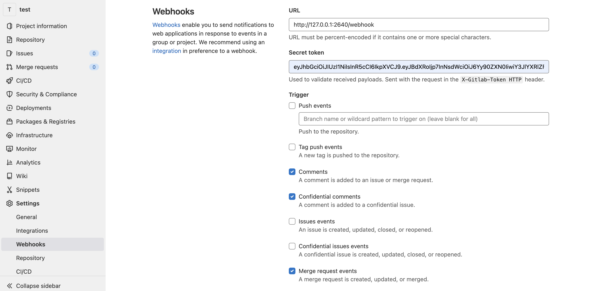

# review-bot


gitlab review-bot

## Settings

### Step 1: Create Private Token



### Step 2: Deploy Review Bot

```shell
docker run -d -p 2640:2640 \
    -e BOT_SCM_HOST=https://gitlab.com \
    -e BOT_SCM_TOKEN=<your-private-token> \
    -e BOT_SCM_SECRET=<your-webhook-secret> \
    zc2638/review-bot:latest
```

- `https://gitlab.com` replace with the actual gitlab server address
- `<your-private-token>` replace with the token generated by step1
- `<your-webhook-secret>` replace with a custom password for the webhook, which can be a random string

### Step 3: Generate Webhook Secret

1. Directly access the interface to request to obtain the secret key

`GET /secret?namespace=zc&name=test`

2. Visit Online API Doc `http://<your-server-address>/swagger/ui`



### Step 4: Add Project Webhook



- add webhook to associated project, URL is `http://<your-host-address>/webhook`
- the `review-bot` user must have your project permissions
- webhook must set sufficient permissions(e.g. `Comments`、`Confidential Comments`、`Pull request events`)

### Step 5: Add Project Config

Please add the `.gitlab/review.yml` configuration file to the default branch of the project repository.  
You can refer to the [`.gitlab` directory](./.gitlab) settings of this project.

```yaml
# can use /lgtm
reviewers:
  - reviewer1
  - reviewer2

# can use /approve
approvers:
  - approver1
  - approver2

# merge request settings
pullrequest:
  # The merge information is mainly based on the title of PR
  # otherwise it is mainly based on the content of <!-- title --><!-- end title --> in PR description template
  squash_with_title: true

# custom label settings
custom_labels:
  # Operation instructions in comments
  - order: /kind cleanup
    # Label name associated with the instruction
    name: kind/cleanup
    # Automatically add prefix for merged submission information
    short: cleanup
    # Label background color
    color: #33a3dc
    # Label description
    description: "kind: cleanup code"

  - order: /area scheduler
    name: area/scheduler
    color: #96582a
    description: "area: scheduler service code area"
```

### Step 6 (optional): Add Merge Request Template

- Download at url `GET /download?type=gitlab`
- Unzip and move the directory `gitlab` to `.gitlab` in your project

You can refer to the [`.gitlab` directory](./.gitlab) settings of this project.

**Please Enjoy it**

## Deploy

### Local

```
go run github.com/zc2638/review-bot/cmd -c config/config.yaml
```

### Docker

```
docker run -d -p 2640:2640 \
    -e BOT_SCM_HOST=https://gitlab.com \
    -e BOT_SCM_TOKEN=<your-private-token> \
    -e BOT_SCM_SECRET=<your-webhook-secret> \
    zc2638/review-bot:latest
```

## Config

change config file in `config/config.yaml`

```
server:
  port: 2640
scm:
  host: https://gitlab.com
  token: <your-private-token>
  secret: <your-webhook-secret>
```

| Configuration Item | Environment Variable |          Description           |
|:------------------:|:--------------------:|:------------------------------:|
|    server.port     |   BOT_SERVER_PORT    |   bot server listening port    |
|      scm.host      |     BOT_SCM_HOST     | source code management address |
|     scm.token      |    BOT_SCM_TOKEN     |         private token          |
|     scm.secret     |    BOT_SCM_SECRET    |         webhook secret         |
